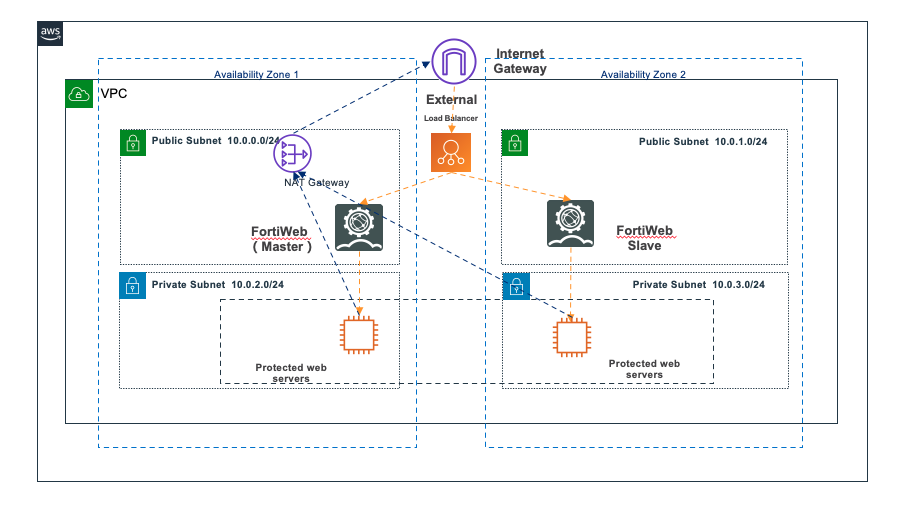

# 概述
Fortinet Fortiweb WAF For AWS 解决方案对试图对您的 Web 应用服务器的请求提供保护。下图表示您可以使用该解决方案实施指南和随附的 AWS CloudFormation 模板构建的架构。与在传统环境中部署 WAF 不同，在云上部署WAF建议公有网和私有子网分离。该方案通过ALB 或 NLB 接受用户流量，并分发到位于不同可用区的FortiWeb 服务器上。Fortiweb 则根据设置规则对请求进行检验之后，通过其自身的分发功能把处理后的流量继续发往位于私有网络中并需要包含的Web服务器。

# 防护场景

Web应用程序容易受到各种攻击。这些攻击包括旨在利用漏洞或控制服务器的特制请求。旨在摧毁网站的大规模攻击；或设计为抓取和窃取Web内容的不良机器人和抓取工具。
该解决方案利用AWS CloudFormation快速轻松地配置，并有助于阻止以下常见攻击：

* SQL注入：攻击者将恶意SQL代码插入Web请求中，以从数据库中提取数据。此解决方案旨在阻止包含潜在恶意SQL代码的Web请求。
* 跨站点脚本：也称为XSS，攻击者利用良性网站中的漏洞将恶意客户端站点脚本注入合法用户的Web浏览器中。此解决方案旨在检查传入请求中常用的元素，以识别和阻止XSS攻击。
* HTTP泛洪：Web服务器和其他后端资源面临HTTP泛洪等分布式拒绝服务（DDoS）攻击的风险。当来自客户端的Web请求超过可配置的阈值时，此解决方案将自动触发基于速率的规则。或者，通过使用AWS Lambda函数或Amazon Athena查询处理AWS WAF日志来实施此阈值。
* 扫描程序和探查：恶意源扫描并探查面向Internet的Web应用程序是否存在漏洞。它们发送一系列生成HTTP 4xx错误代码的请求，您可以使用此历史记录来帮助识别和阻止恶意源IP地址。此解决方案创建一个AWS Lambda函数或Amazon Athena查询，该查询可自动解析Amazon CloudFront或Application Load Balancer访问日志，计算每分钟来自唯一源IP地址的错误请求的数量，并更新AWS WAF以阻止来自具有高地址的地址的进一步扫描错误率–达到定义的错误阈值的错误率。
* 已知攻击者来源（IP信誉列表）：许多组织维护由已知攻击者（例如，垃圾邮件发送者，恶意软件分发者和僵尸网络）操作的IP地址的信誉列表。该解决方案利用这些信誉列表中的信息来帮助您阻止来自恶意IP地址的请求。
* 僵尸程序和爬虫程序：可公开访问的Web应用程序的操作员必须相信，访问其内容的客户端可以准确地标识自己，并且可以按预期使用服务。但是，某些自动客户端（例如内容抓取工具或不良的漫游器）会歪曲自己，以绕过限制。此解决方案可帮助您识别并阻止不良的爬虫。


# 功能特性

* 标准安全能力
    * 防护OWASP TOP10威胁：内置多种防护策略，可以选择防护SQL注入，XSS跨站，Web Shell，后门，命令注入，非法HTTP协议请求，常见Web服务器漏洞攻击，核心文件非授权访问，路径传阅，扫描防护等等
    * 威胁情报：海量恶意IP黑名单，包括僵尸网络，匿名代理，钓鱼网站，垃圾邮件等恶意的IP封禁能力
    * 防护基础恶意爬虫：封禁libcurl，Python脚本等构造的恶意访问
    * HTTP/HTTPS访问控制：IP访问控制，URL访问控制，目标系统管理后台保护
* 高级安全能力
    * 防止恶意CC攻击：基于HTTP访问请求频率/TCP连接频率/人机识别等综合智能分析有效拦截CC攻击
    * 0day高精准安全防御：基于双层机器学习引擎构建异常威胁检测模型，对Web攻击具有较高的精准识别能力，可以自动发现0day等未知攻击，有效减少攻击误报.
* 业务安全能力
    * 高级防爬虫：基于user-agent，IP，客户端事件及AI的人机识别技术精准识别爬虫。
    * 网站防盗链：避免网站资源被其他网站恶意链接、使用
    * 防漏洞扫描：检测攻击则采用工具对网站进行漏洞扫描，并通过人机交互进行精准确认，最终准确拦截攻击者

# 系统架构


1. 公有私网及私有子网：此方案创建两种不同的子网，公有子网和私有子网。建议被 Fortiweb 保护的Web 服务器部署在私有子网中。
2. ALB 及 NLB：此解决方案Fortiweb服务器前端的负载均衡可以是 AWS Application Loadblance ,也可以是 Network Load Balance.
3. 自动化部署：本方案提供Clouformation模板，用户可以借助基础架构即代码的的能力来实现该方案的部署自动化，可以选择创建单节点或多节点集群，形成针对Web服务的基础防护能力。
4. 高可用架构：为了满足用户对Web安全高可用性及冗余性的需求，该方案提供了Active-Active-High volume 的部署模式，在不同的可用区创建 Fortiweb Master 节点及 Fortiweb Slave 节点。如果 Master 节点出现故障，那么 Slave 的节点会自动升级为 Master 节点，确保系统功能的高可用性。
5. 数据流向：互连网用户如果要访问位于私有子网的 Web 服务器
    1. 第一步，流量会经过 Internet Gateway (IGW)。
    2. 第二步，会经过负载均衡(可以是 ALB类型，也可以是 NLB类型）转发
    3. 第三步，请求会转发到 FortieWeb 服务器，根据配置的 WAF 规则进行请求的检测。如果发现请求是恶意的，可以选择针对请求进行日志的记录或者是阻止。
    4. 第四步，正常请求会发送到受保护的 Web 服务器。

6. 位于私有网络受保护的 Web Server 如果需要访问互联网，例如更新软件等操作。该种请求会经过NAT Gateway进行流量的转发。

## 如何进行构建


* 请按照如下步骤:

```
cd deployment
chmod +x ./build-s3-dist.sh \n
./build-s3-dist.sh TEMPLATE_BUCKET_NAME $DIST_OUTPUT_BUCKET $SOLUTION_NAME $VERSION \n
```

例如: 如果需要需要在 S3存储桶 （s3bucketname） 中 则需要运行

```
./build-s3-dist.sh s3bucketname s3bucketname fortinet-fortiweb-waf-for-aws v1.0.0 
```

运行完毕后，会在 /deployment 的目录中生成 /global-s3-assets 和 /region-s3-assets 的两个目录

```
│   ├── global-s3-assets
│   │   ├── fwb-ha-vpc-alb-main.template
│   │   ├── ha-instance-create-alb.template
│   │   └── ha-vpc-create-alb.template
│   │   ├── fwb-ha-vpc-nlb-main.template
│   │   ├── ha-instance-create-nlb.template
│   │   └── ha-vpc-create-nlb.template
│   ├── regional-s3-assets
│   │   ├── lambda
            └── lambda-alb.zip
            └── lambda-nlb.zip

```


*** 

## 文件结构

```

├── deployment
│   ├── build-s3-dist.sh                [Shell -  用于构建该解决方案]
│   ├── fwb-ha-vpc-alb-main.template        [Cloudformation - 主函数-用于 ALB]
│   ├── ha-instance-create-alb.template     [Cloudformation - 创建 EC2实例，安装 Fortiweb-用于 ALB]
│   ├── ha-vpc-create-alb.template          [Cloudformation - 创建 VPC-用于 ALB]
│   ├── fwb-ha-vpc-nlb-main.template        [Cloudformation - 主函数-用于 NLB]
│   ├── ha-instance-create-nlb.template     [Cloudformation - 创建 EC2实例，安装 Fortiweb用于 NLB]
│   ├── ha-vpc-create-nlb.template          [Cloudformation - 创建 VPC用于 NLB]


├── source
│   └── lambda
│       ├── cfnresponse.py                      [Python - Lambda 返回值]
│       └── index.py                            [Python - Lambda 创建 EC2,注入 Userdata并创建 Fortiweb active-active 集群]
        └── policy                                          [FortiWeb 场景规则]
        │       ├── AntiCrawler                             [反爬虫场景]
        │       │   ├── AntiCrawler.txt                     [反爬虫场景规则]
        │       │   └── ReadMe.txt                          [反爬虫场景使用文档]
        │       ├── GeneralWebSiteProtect                   [通用网站保护场景]
        │       │   ├── GeneralWebSiteProtect.txt           [通用网站保护场景规则]
        │       │   └── ReadMe.txt                          [通用网站保护场景使用文档]
    │       ├── ProtectDDoS                                 [DDoS保护场景]
        │       │   ├── ProtectDDoS.txt                     [DDoS场景规则]
        │       │   └── ReadMe.txt                          [DDoS护场景使用文档]
        │       ├── ProtectDatabaseBruteForce               [数据库撞库场景]
        │       │   ├── ProtectDatabaseBruteForce.txt       [数据库撞库场景规则]
        │       │   └── ReadMe.txt                          [数据库撞库场景使用文档]
        │       ├── ProtectECommerce                        [电子商务类网站保护场景]
        │       │   ├── ProtectECommerce.txt                [电子商务类网站保护场景规则]
        │       │   └── Readme.txt                          [电子商务类网站保护场景使用文档]
    │       └── ProtectHotlinking                           [网页防盗链场景]
        │           ├── ProtectHotlinking.txt               [网页防盗链场景规则]
        │           └── ReadMe.txt                          [网页防盗链场景使用文档]

```

## 如何导入场景规则

场景规则导入需要使用 SSH 远程登录到 FortiWeb 服务器并导入。请下载 /source/policy/ 目录下的文件，根据需要选择场景。
例如选择反爬虫的场景 进入 /source/policy/AntiCrawler 目录， FortiWeb 服务器的 IP 地址是 161.189.x.x, 该EC2的密钥对是 zhy.pem
请执行如下的命令。

```
ssh -i ~/zhy.pem admin@161.189.x.x > /dev/null 2>&1 < AntiCrawler.txt
```


***


Copyright Amazon.com, Inc. or its affiliates. All Rights Reserved.

Permission is hereby granted, free of charge, to any person obtaining a copy of this
software and associated documentation files (the "Software"), to deal in the Software
without restriction, including without limitation the rights to use, copy, modify,
merge, publish, distribute, sublicense, and/or sell copies of the Software, and to
permit persons to whom the Software is furnished to do so.

THE SOFTWARE IS PROVIDED "AS IS", WITHOUT WARRANTY OF ANY KIND, EXPRESS OR IMPLIED,
INCLUDING BUT NOT LIMITED TO THE WARRANTIES OF MERCHANTABILITY, FITNESS FOR A
PARTICULAR PURPOSE AND NONINFRINGEMENT. IN NO EVENT SHALL THE AUTHORS OR COPYRIGHT
HOLDERS BE LIABLE FOR ANY CLAIM, DAMAGES OR OTHER LIABILITY, WHETHER IN AN ACTION
OF CONTRACT, TORT OR OTHERWISE, ARISING FROM, OUT OF OR IN CONNECTION WITH THE
SOFTWARE OR THE USE OR OTHER DEALINGS IN THE SOFTWARE.
